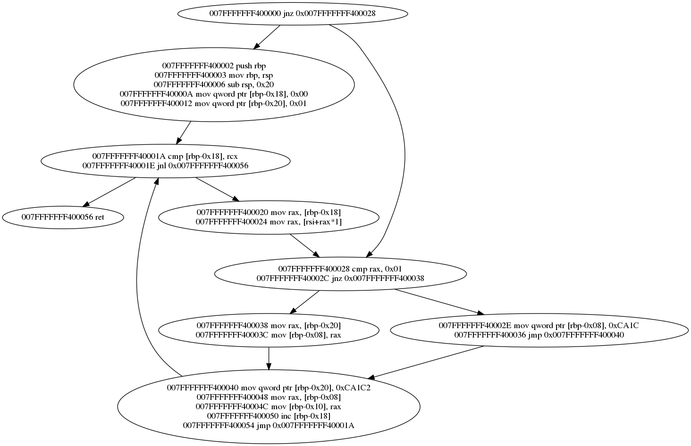

# bkcfger

This is a program that enables to convert x86_64 assembly instructions into a CFG.  
   
You can use the "_draw.sh_" script to convert the '_graph.dot_' file to a png (Graphviz' _dot_ tool is required).  
Relies on Zydis for the disassembly.  
  
#### Output example:

